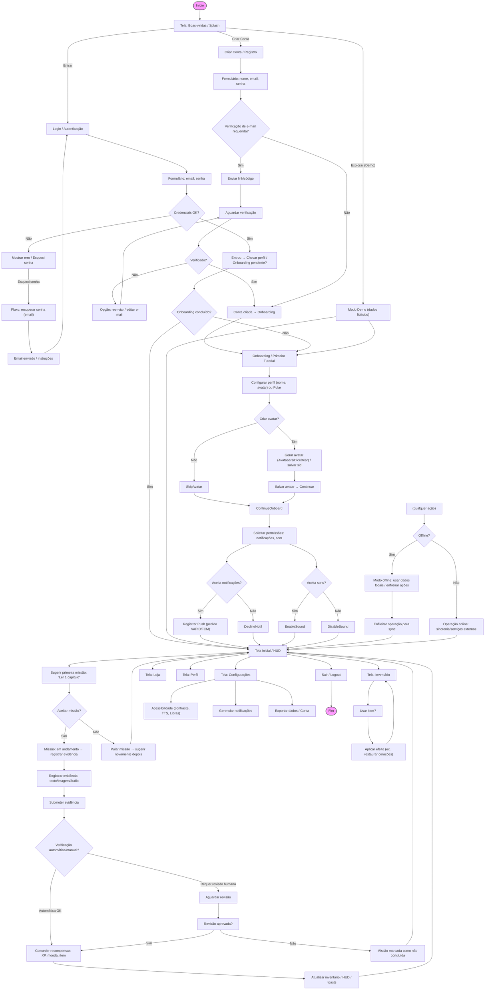

# Fluxograma — Primeiro Acesso e Todos os Fluxos Possíveis

Este documento contém o fluxograma do fluxo de primeiro acesso ao app e todos os caminhos derivados (login/criação de conta, explorar demo, onboarding, permissões, missão inicial, inventário, configurações e fluxos de erro/offline). O diagrama está em Mermaid para fácil visualização em ferramentas que o suportem.

Resumo dos principais fluxos documentados:

- **Criar Conta:** formulário → (opcional) verificação por e-mail → onboarding → perfil/avatar → permissões → tela inicial.
- **Login:** formulário → autenticação → checagem de onboarding → tela inicial; inclui recuperação de senha.
- **Explorar (Demo):** modo rápido sem criar conta que leva ao onboarding simplificado e ao HUD com dados fictícios.
- **Onboarding:** configurações iniciais (perfil, avatar), preferências de acessibilidade e solicitações de permissão (notificações, som).
- **Missão Inicial:** sugestão de missão, aceitação, registro de evidência (texto/imagem/áudio), verificação (automática ou manual), recompensa e atualização do inventário/HUD.
- **Offline:** modo offline usa JSONs locais em `/dados/` e enfileira ações para sincronização posterior.
- **Configurações:** controle de acessibilidade (TTS, Libras, contraste), notificações e exportação de dados.

Observações e extensões possíveis

- Posso exportar este fluxograma para SVG/PNG (renderizando o Mermaid) se preferir uma imagem pronta para apresentação.
- Posso também inserir uma versão reduzida do fluxograma dentro de `docs/BIBLIA_GAMEPRAY_SPEC.md` ou criar uma arte no `docs/assets/`.

Deseja que eu: (responda com uma opção)

- `Aplicar em SPEC` — insiro o fluxograma (ou link) em `docs/BIBLIA_GAMEPRAY_SPEC.md`.
- `Exportar imagem` — tento gerar PNG/SVG do diagrama e salvo em `docs/assets/`.
- `Nada` — apenas manter o arquivo e continuar com as próximas tarefas do TODO.
